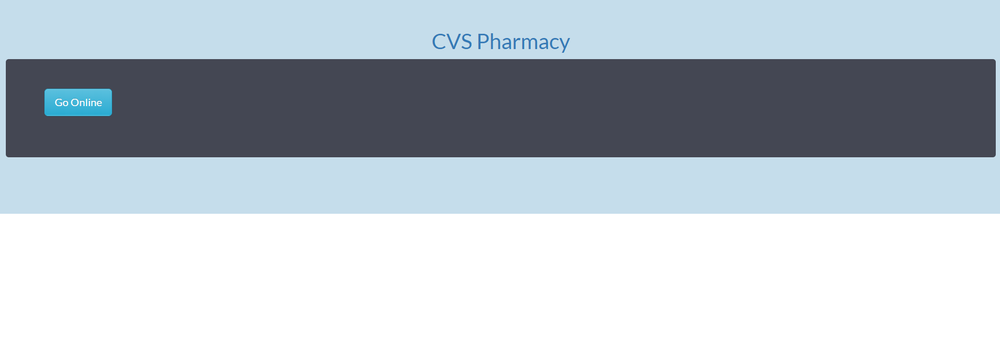
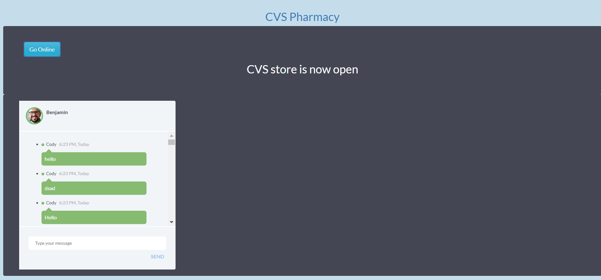
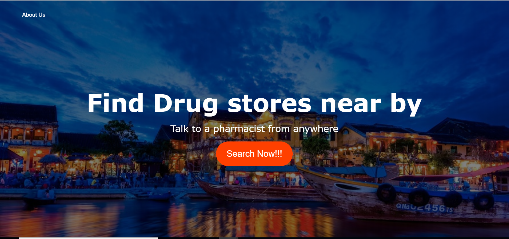
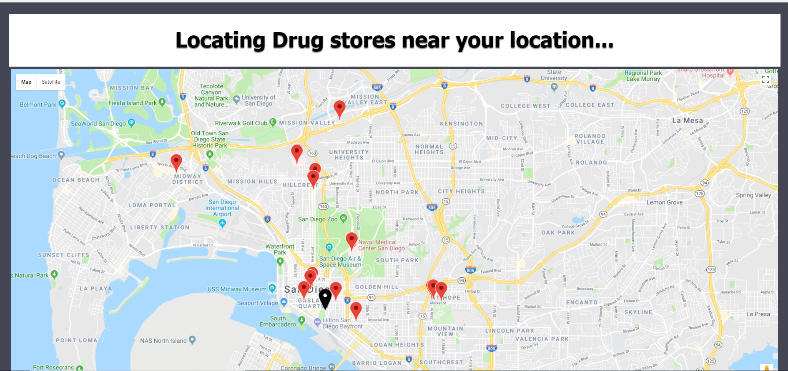
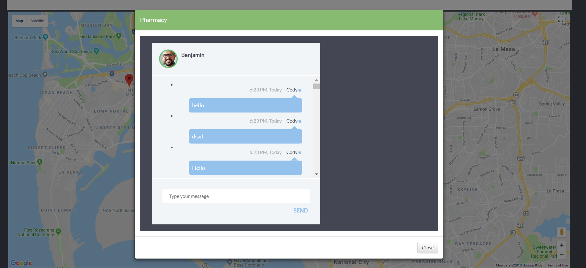

# Find Pharmacy in Real time
## Synopsis
 This application connects the customers with pharmacies using Google maps and enables the users to chat with the pharmacist in real time and get the right medicine. It also enables pharmacists to build their digital presence and provide better customer servicee.
 
## Motivation
A simple project to understand how PubNub SDK & Chat Engine can be integrated with Google Maps and places API to build a real time application that connects customers to pharmacists.

## Installation
  ### Pre-requisite 
  - This needs PubNub API Publish/Subscribe Keys.
  - Google Maps/Places API Keys.
  - Needs PubNub SDK and PubNub chat engine SDK
  ### Setup
  1. Clone repository 
  ```
  https://github.com/pradeepdm/pradeepdm.github.io.git
  ```
  2. Switch to the project directory
  ``` 
  cd pradeepdm.github.io 

```  
  ### Run the application
  1. Run the `https://pradeepdm.github.io/index.html`
   
  2. Click on the `Search Now !!!` present in the index.html. The application will now be redirected to a new page to locate and display the drug stores present nearby.
  
  3. Run the `https://pradeepdm.github.io/pharmacy-vendor-cvs.html` from a different machine or in the Browser Incognito Mode if you are running it on the same machine (to use chat box) and go online using the given button.
  
  4. Click on the online drug stores (google markers with Black pin location) from the find Pharmacy webpage to see the store details and initiate a chat with the pharmacist.
  
## Workflow
  There are two users of this application. 
  - Pharmacist or Drug store owners
  - Customers who are in search of online drug stores
  
  ### Use case - 1 (For pharmacists / Drug store owners)
  Drug stores can use this application to interact with the customers in real time and assist them with their queries. To  do this, a drug store owner/ pharmacist will visit this application and come online by using the interface provided by the application. 
  Once they go online, they will be presented with a chat window where they can send and receive messages from customers.
  
  ### Use case - 2 (Customers in search of online drug store)
  Customers can visit this application to find the drug stores. Once the user hits the search button, they will be presented with the pharmacies that are present near by based on their current location.
  This can be seen on the Google Maps and the user will be able to find both online and offline stores. The online stores are distinguished using the Black pin Google Marker.
  When the user clicks on one of the online drug stores, they can see the details and initiate a chat with the pharmacist.
  At this moment, they are connected with the pharmacist and presented with a chat window..
  
  ####
  Please find the link to the Live Demo:
   `https://youtu.be/x97JmdDOgdo`

## API Reference 
   1.[PubNub](https://www.pubnub.com/docs)
   
   2.[Google Maps API](https://developers.google.com/maps/)

## Screenshots

  ### Usecase - 1  
  
  
  

  ### Usecase - 2
  
  
  
  
  

## License
MIT

