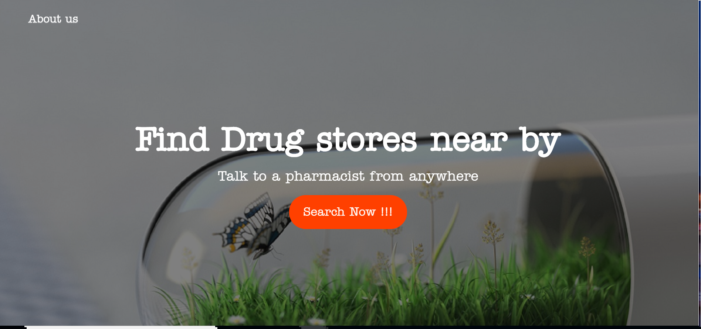

# Find Pharmacy in Real time
## Synopsis
 This application lets owners of pharmacy stores interact with the consumers 
 in real time using PubNub. It lets customers find pharmacies using google maps 
 and chat with the pharmacist in real time.
 
## Motivation
A simple project to understand how PubNub SDK & Chat Engine can be integrated with Google Maps and places API to build a real time application that connects customers to pharmacists.

## Installation
  ### Pre-requisite 
  - This needs PubNub API Publish/Subscribe Keys.
  - Google Maps/Places API Keys.
  - Needs PubNub SDK and PubNub chat engine SDK
  ### Setup
  1. Clone repository 
  ```
  https://github.com/pradeepdm/find-pharmacy.github.io
  ```
  2. Switch to the project directory
  ``` 
  cd find-pharmacy.github.io 

```  
  3. Run the `index.html`
   
  4. Click on the `Search Now !!!` present in the index.html. The application will now be redirected to a new page to locate and display the drug stores present near by.
  
  5. Run the `pharmacy-vendor-cvs.html` in Incognito Mode (to use chat box) and go online.
  
  6. Run the `pharmacy-vendor-rite-aid.html` in Incognito Mode (to use chat box) and go online.
  
  7. Click on the online drug stores (google markers with Black pin location) to see the details and initiate a chat with the pharmacist.
  
## Workflow
  There are two users of this application. 
  - Pharmacist or Drug Store Owners
  - Customers (Customers in search of Online drug store)
  
  ### Usecase - 1 (For pharmacists/ drug store owners)
  Drug stores can use this application to interact with the customers in real time who need more information about the drug/medicine. To do this, a drug store owner/ pharmacist will visit this application and come online by using the interface provided by the application. 
  Once they go online, they will be presented with a chat window where they can send and recieve messages from customers.
  
  ### Usecase - 2 (Customers in search of online drug store)
  Customers can visit this application to find the drug stores. Once the user hits the search button, they will be presented with the all the pharmacies based on their current location.
  This list is displayed on the Google Maps. Users will be able to find both online and offline stores. The online stores are distinguished using a different Google Marker (Black pin location).
  When the user clicks on one of the online drug stores, they can see the details and initiate an chat with the pharmacist.
  At this moment, they are connected to the pharmacist and presented with a chat box modal.

## API Reference 
   1.[PubNub](https://www.pubnub.com/docs)
   
   2.[Google Maps API](https://developers.google.com/maps/)

## Screenshots

  ### Usecase - 1  
  
  
  

  ### Usecase - 2
  
  
  
  
  

## License
MIT
